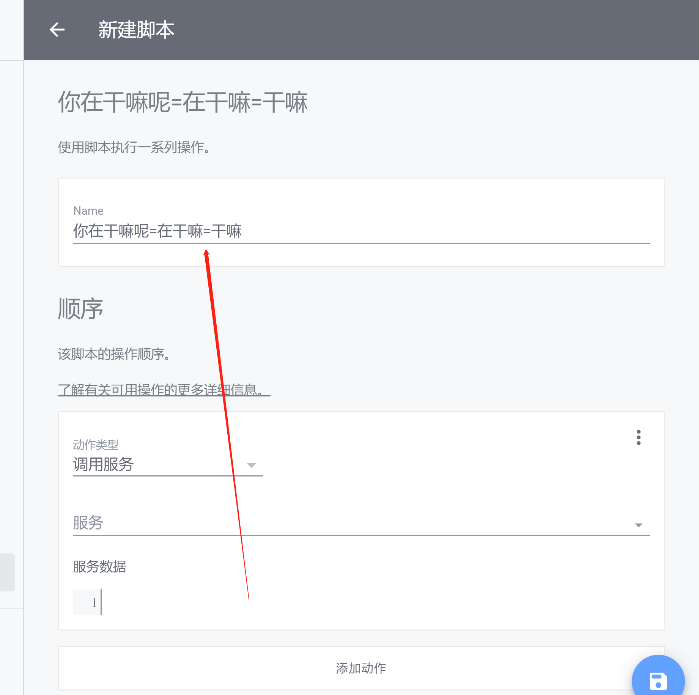

# ha_voice
在HA里使用的语音小助手

# 安装方式
 - 使用HACS安装
 - 自定义安装

# 使用方式

configuration.yaml 配置
```

# base_url：因为要把录好的信息发回到HA里，所以必须要配置 base_url（没有外网地址就不用配置）
# cors_allowed_origins：跨域域名（如果你的域名支持HTTPS，则可以不用配置这个）
http:
  base_url: 在外网使用时必须配置
  cors_allowed_origins:
    - https://api.jiluxinqing.com

# 百度语音识别必须的配置：app_id、api_key、secret_key
# 申请地址：https://ai.baidu.com/tech/speech/asr
ha_voice:
  app_id: '15147521'
  api_key: 'NXQYhBSGYb6xve8m3FmwOrkU'
  secret_key: 'Zio57yIahYxXLMPmV7FSkG4ahfe0zbXg'

```

前端自定义卡片配置
```

type: 'custom:ha-voice-panel'
cmd:
  - 切换所有灯
  - 切换所有开关
  - 关闭所有灯
  - 关闭所有开关
  - 这里是快捷操作方式
  - 避免打字麻烦

```

# 功能介绍

## 1.在HTTPS的域名下，自动识别是否支持Google服务（识别更快）
- PC端可以访问Google服务时，使用Google语音识别，否则使用定义的百度识别API
- 移动端目前只支持百度识别
- 百度录音时间为4秒，后期可能会改成自己配置

## 2.触发对应的自定义脚本
- 当语音文本与脚本名称一致时，则触发脚本
- 语音文本匹配多个内容时，脚本名称使用=号分隔


## 3.调用系统内置的语音解析服务
- 如果要使用更高级的功能，那就使用系统内置的 [conversation组件](https://www.home-assistant.io/integrations/conversation/)

## 4.发送语音识别事件
- 如果你开发了一个组件，可以监听ha_voice_text_event事件
- 每次收到语音文本后，会触发这个事件，将识别的内容发送出来，然后可以做对应的事情

# 注意事项

## 目前Google语音在移动端使用有问题(暂时就这样，反正不能用)

## 域名不支持HTTPS

如果你的域名不支持HTTPS，则会跳转到我的HTTPS域名下，所以要配置跨域设置

## 如果操作中有问题，请提Issues


# 更新日志

### v1.1
- 调整检测Google服务时间，8秒调整为11秒
- 修改使用api的逻辑
- 添加启动信息注释
- 修改跨域请求逻辑
- Google服务只能在Chrome浏览器里可用

### v1.0
- 基本功能实现